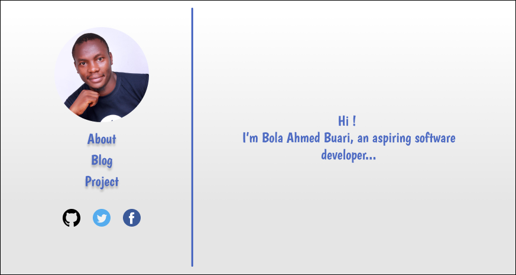

# HNG Internship 5
### Stage 1

1. **Git Task:** 
Sign up for GitHub. Create a personal repository. Commit a file. Pull the file. Change stuff. Commit again. 

   :heavy_check_mark: [Link to repository having at least two commits to one file](https://github.com/bolah2009/hng-internship)
3. **Create a blog post:** 
If you do not have a blog, start one on blogspot, WordPress, medium or anywhere else you want.

   :heavy_check_mark: [Link to your blog/WordPress/medium - please write your first post to ensure you are the owner](https://medium.com/@bolah2009/my-first-medium-story-b64036431713)

2. **Design Task:** 
Use Figma to design yourself a home page. Your page must follow a particular format: Your picture on the top left corner. Links below your picture About, Blog, Projects. Below that are three icons with links to your social media. On the right (separated by a line from the left section), will be some welcoming information for you.

   :heavy_check_mark: [Link to figma task showing your profile page design](https://www.figma.com/file/PwzkvAFw3CxFZxTLRCc4nSx4/HNG-5-Task-1?node-id=0%3A1)

***Screenshot of what I did in Figma*** 

